# Caption Studio Backend - Architecture Diagrams

> **Visual guide to system architecture, request flows, and component interactions**  
> **Last Updated:** October 31, 2025

---

## 📊 Table of Contents

1. [System Overview](#system-overview)
2. [Layered Architecture](#layered-architecture)
3. [Authentication Flow](#authentication-flow)
4. [File Upload Flow](#file-upload-flow)
5. [Bulk Operations Flow](#bulk-operations-flow)
6. [Database Schema](#database-schema)
7. [Deployment Architecture](#deployment-architecture)
8. [Security Layers](#security-layers)

---

## 🏗️ System Overview


---

## 🎯 Layered Architecture (SOLID Principles)


### **Layer Responsibilities**

| Layer | Purpose | Examples | Dependencies |
|-------|---------|----------|--------------|
| **Routes** | Define API endpoints | `POST /api/auth/login` | Controllers |
| **Controllers** | Handle HTTP requests/responses | `AuthController.login()` | Services, Middleware |
| **Services** | Business logic and orchestration | `UploadService.processUpload()` | Repositories, External APIs |
| **Repositories** | Database operations | `FileRepository.findById()` | Models, Database |
| **Models** | Domain entities and validation | `File.isImage()` | None |

---

## 🔐 Authentication Flow


---

## 📤 File Upload & Analysis Flow


---

## 🔄 Bulk Upload Flow (Up to 10 Files)


---

## 💾 Database Schema (Supabase PostgreSQL)


### **Row-Level Security (RLS) Policies**

```sql
-- Users can only see their own files
CREATE POLICY "Users can view own files"
ON uploaded_files FOR SELECT
USING (auth.uid() = user_id);

-- Users can only insert their own files
CREATE POLICY "Users can insert own files"
ON uploaded_files FOR INSERT
WITH CHECK (auth.uid() = user_id);

-- Users can only update their own files
CREATE POLICY "Users can update own files"
ON uploaded_files FOR UPDATE
USING (auth.uid() = user_id);

-- Users can only delete their own files
CREATE POLICY "Users can delete own files"
ON uploaded_files FOR DELETE
USING (auth.uid() = user_id);
```

---

## 🚀 Deployment Architecture


### **Deployment Pipeline Flow**

```
┌─────────────────────────────────────────────────────────┐
│  Developer pushes to main                               │
├─────────────────────────────────────────────────────────┤
│  ✅ Run 173 tests (3 Node versions in parallel)        │
├─────────────────────────────────────────────────────────┤
│  ✅ Security scan (npm audit, secret detection)        │
├─────────────────────────────────────────────────────────┤
│  ✅ Build verification (server starts successfully)    │
├─────────────────────────────────────────────────────────┤
│  🚀 Auto-deploy to Render (only if all pass)           │
├─────────────────────────────────────────────────────────┤
│  ⏳ Wait 60 seconds for deployment to start            │
├─────────────────────────────────────────────────────────┤
│  ✅ Health check with 10 retries (30s between)         │
├─────────────────────────────────────────────────────────┤
│  ✅ Deployment successful!                              │
└─────────────────────────────────────────────────────────┘
```

---

## 🔒 Security Layers

```mermaid
graph TD
    REQ[Incoming Request]
    
    subgraph "Layer 1: Network Security"
        CORS[CORS Policy<br/>Environment-aware origins]
        HTTPS[HTTPS/TLS<br/>HSTS Headers]
    end
    
    subgraph "Layer 2: Rate Limiting"
        AUTH_LIMIT[Auth Endpoints<br/>10 req/15min]
        API_LIMIT[API Endpoints<br/>100 req/15min]
    end
    
    subgraph "Layer 3: Security Headers"
        HELMET[Helmet.js<br/>CSP, X-Frame-Options]
    end
    
    subgraph "Layer 4: Authentication"
        JWT[JWT Verification<br/>Supabase Auth]
        RLS[Row-Level Security<br/>Database Policies]
    end
    
    subgraph "Layer 5: Input Validation"
        SANITIZE[File Sanitization<br/>Path traversal prevention]
        VALIDATE[Input Validation<br/>Type, size, format checks]
    end
    
    subgraph "Layer 6: Authorization"
        OWNER[Ownership Check<br/>user_id validation]
        SCOPE[Resource Scope<br/>Access control]
    end
    
    subgraph "Layer 7: Cryptography"
        CRYPTO[Secure Random<br/>crypto.randomBytes()]
        HASH[Password Hashing<br/>Supabase bcrypt]
    end
    
    REQ --> CORS
    CORS --> HTTPS
    HTTPS --> AUTH_LIMIT
    AUTH_LIMIT --> API_LIMIT
    API_LIMIT --> HELMET
    HELMET --> JWT
    JWT --> RLS
    RLS --> SANITIZE
    SANITIZE --> VALIDATE
    VALIDATE --> OWNER
    OWNER --> SCOPE
    SCOPE --> CRYPTO
    CRYPTO --> HASH
    
    style CORS fill:#ff6b6b,stroke:#333,stroke-width:2px
    style JWT fill:#ffd700,stroke:#333,stroke-width:2px
    style RLS fill:#ffd700,stroke:#333,stroke-width:2px
    style SANITIZE fill:#90EE90,stroke:#333,stroke-width:2px
    style CRYPTO fill:#87CEEB,stroke:#333,stroke-width:2px
```

### **Security Features Matrix**

| Layer | Feature | Implementation | Status |
|-------|---------|----------------|--------|
| **Network** | CORS | Environment-aware origins | ✅ |
| **Network** | HTTPS | HSTS headers (1 year) | ✅ |
| **Rate Limit** | Auth endpoints | 10 req/15min | ✅ |
| **Rate Limit** | API endpoints | 100 req/15min | ✅ |
| **Headers** | CSP | Content Security Policy | ✅ |
| **Headers** | X-Frame-Options | DENY | ✅ |
| **Auth** | JWT | Supabase Auth | ✅ |
| **Auth** | Password Policy | 12+ chars, complexity | ✅ |
| **Database** | RLS Policies | User isolation | ✅ |
| **Database** | UUID IDs | Non-sequential | ✅ |
| **Input** | File Sanitization | Path traversal prevention | ✅ |
| **Input** | File Validation | Type, size, MIME checks | ✅ |
| **Crypto** | Secure Random | crypto.randomBytes() | ✅ |
| **Logging** | Security Events | Centralized logger | ✅ |

---

## 📊 Request Flow Examples

### **Authenticated File List Request**

```mermaid
sequenceDiagram
    participant Client
    participant Server
    participant Middleware
    participant Controller
    participant Repository
    participant Database

    Client->>Server: GET /api/files?page=1&limit=20<br/>Authorization: Bearer {token}
    
    Server->>Middleware: Rate Limit Check
    Middleware-->>Server: ✓ Under limit
    
    Server->>Middleware: CORS Check
    Middleware-->>Server: ✓ Allowed origin
    
    Server->>Middleware: Auth Verification
    Middleware->>Database: Verify token with Supabase
    Database-->>Middleware: {user: {id, email}}
    Middleware->>Middleware: Attach req.user
    Middleware-->>Server: ✓ Authenticated
    
    Server->>Controller: FilesController.listFiles()
    Controller->>Repository: FileRepository.findAll(userId, pagination)
    Repository->>Database: SELECT * FROM uploaded_files<br/>WHERE user_id = $1<br/>LIMIT 20 OFFSET 0
    Database-->>Repository: [{file1}, {file2}, ...]
    Repository-->>Controller: [File, File, ...]
    Controller-->>Client: 200 OK<br/>{files: [...], pagination: {...}}
```



### **File Update Request**

```mermaid
sequenceDiagram
    participant Client
    participant Server
    participant Middleware
    participant Controller
    participant Repository
    participant Database

    Client->>Server: PATCH /api/files/123<br/>{filename: "new.jpg", tags: [...]}
    
    Server->>Middleware: Authenticate
    Middleware-->>Server: ✓ User authenticated
    
    Server->>Controller: FilesController.updateFile()
    Controller->>Controller: Validate input
    Controller->>Controller: Sanitize filename
    
    Controller->>Repository: FileRepository.findById(123, userId)
    Repository->>Database: SELECT * FROM uploaded_files<br/>WHERE id = $1 AND user_id = $2
    
    alt File exists and owned by user
        Database-->>Repository: {file}
        Repository-->>Controller: File entity
        
        Controller->>Repository: FileRepository.update(123, data)
        Repository->>Database: UPDATE uploaded_files<br/>SET filename = $1, tags = $2<br/>WHERE id = $3 AND user_id = $4
        Database-->>Repository: {updatedFile}
        Repository-->>Controller: File entity
        Controller-->>Client: 200 OK<br/>{file: {...}}
    else File not found or not owned
        Database-->>Repository: null
        Repository-->>Controller: null
        Controller-->>Client: 404 Not Found
    end
```



---

## 🎨 Component Interaction Map


---

## 📈 Performance Characteristics

### **API Response Times** (Average)

| Endpoint | Target | Actual | Notes |
|----------|--------|--------|-------|
| `GET /health` | < 50ms | ~10ms | No external calls |
| `POST /api/auth/login` | < 500ms | ~300ms | Supabase Auth |
| `GET /api/files` | < 200ms | ~150ms | Database query |
| `POST /api/upload/upload-and-analyze` | < 10s | ~8s | Includes AI analysis |
| `POST /api/upload/bulk-upload-and-analyze` | < 60s | ~45s | 10 files parallel |
| `POST /api/files/regenerate` (bulk) | < 40s | ~30s | 20 files parallel |

### **Scalability**


---

## 🔄 Data Flow: File Upload to Download

```mermaid
graph TD
    START[User uploads image]
    
    UPLOAD[File sent to server<br/>multipart/form-data]
    VALIDATE[Validate file<br/>extension, size, MIME type]
    SANITIZE[Sanitize filename<br/>remove dangerous chars]
    
    STORAGE[Upload to Supabase Storage<br/>bucket: files/{userId}/]
    URL[Generate public URL<br/>signed URL, 1 year expiry]
    
    DB[Save metadata to database<br/>uploaded_files table]
    
    AI_CALL[Call OpenAI Vision API<br/>analyze image content]
    AI_RESULT[Receive description + tags]
    
    UPDATE[Update database<br/>add AI analysis]
    
    RESPONSE[Return to user<br/>file + analysis]
    
    DISPLAY[User views file in frontend]
    
    DOWNLOAD_REQ[User clicks download]
    FETCH[Backend fetches from Supabase]
    STREAM[Stream file to user]
    
    START --> UPLOAD
    UPLOAD --> VALIDATE
    VALIDATE --> SANITIZE
    SANITIZE --> STORAGE
    STORAGE --> URL
    URL --> DB
    DB --> AI_CALL
    AI_CALL --> AI_RESULT
    AI_RESULT --> UPDATE
    UPDATE --> RESPONSE
    RESPONSE --> DISPLAY
    DISPLAY --> DOWNLOAD_REQ
    DOWNLOAD_REQ --> FETCH
    FETCH --> STREAM
    
    style START fill:#90EE90,stroke:#333,stroke-width:2px
    style AI_CALL fill:#10a37f,stroke:#333,stroke-width:2px
    style STORAGE fill:#3ecf8e,stroke:#333,stroke-width:2px
    style STREAM fill:#87CEEB,stroke:#333,stroke-width:2px
```

---

## 📚 Technology Stack Summary


---

## 🎯 Key Design Patterns

| Pattern | Implementation | Benefit |
|---------|----------------|---------|
| **Layered Architecture** | Controllers → Services → Repositories → Models | Clear separation of concerns |
| **Repository Pattern** | FileRepository abstracts data access | Easy to swap database |
| **Dependency Injection** | ServiceContainer manages dependencies | Loose coupling, testable |
| **Factory Pattern** | ServiceContainer creates service instances | Centralized object creation |
| **Middleware Chain** | Express middleware pipeline | Reusable request processing |
| **Domain Model** | File entity with business logic | Rich domain objects |
| **Interface Segregation** | IAIService, IStorageProvider | Swap implementations easily |
| **Error Handling** | Centralized errorHandler middleware | Consistent error responses |
| **Async/Await** | All async operations use async/await | Cleaner async code |

---

## 📖 Related Documentation

- **[README.md](./README.md)** - Project overview, setup, and API reference
- **[ARCHITECTURE.md](./ARCHITECTURE.md)** - Detailed architecture documentation
- **[API_ENDPOINTS.md](./API_ENDPOINTS.md)** - Complete API endpoint reference
- **[SUPABASE_SETUP.md](./SUPABASE_SETUP.md)** - Database and storage setup
- **[DEPLOYMENT.md](./DEPLOYMENT.md)** - Deployment guide and checklist
- **[TOKEN_SECURITY_ANALYSIS.md](./TOKEN_SECURITY_ANALYSIS.md)** - Security analysis

---

**Last Updated:** October 31, 2025  
**Maintained By:** Backend Team  
**Version:** 1.0.0

